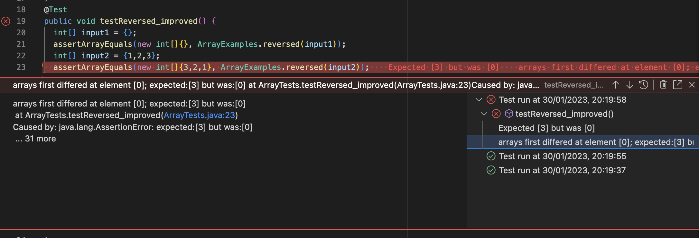

# Lab Report Two for CSE 15L


## Part 1 : Making a String Server

### Code for the string sever program written by me -
```
import java.io.IOException;
import java.net.URI;

class Handler implements URLHandler {
    // The one bit of state on the server: a number that will be manipulated by
    // various requests.
    String text = "";

    public String handleRequest(URI url) {
        if (url.getPath().equals("/")) {
            return String.format("String: %s", text);
        } else {
            System.out.println("Path: " + url.getPath());
            if (url.getPath().contains("/add-message")) {
                String[] parameters = url.getQuery().split("=");
                if (parameters[0].equals("s")){
                    text += "\n"+ parameters[1];
                    return text;
                }
                
            }
            return "404 Not Found!";
        }
    }
}

class StringServer {
    public static void main(String[] args) throws IOException {
        if(args.length == 0){
            System.out.println("Missing port number! Try any number between 1024 to 49151");
            return;
        }

        int port = Integer.parseInt(args[0]);

        Server.start(port, new Handler());
    }
}

```
### Screenshots using the String Server 


- An object of handler class is created along with a page having a local host.

#### First Sceenshot

- Handle Request method of the handler class is used
- The method mainly tackles with the request with the request to the server using the url
- Upon running the method the value of the vairable text is changed each time to aquire the value of the new text to be added
- In this case, it aquired the value of 'First line' and printed it out on the page

#### Second Sceenshot

- Handle Request method of the handler class is used
- The method mainly tackles with the request with the request to the server using the url
- Upon running the method the value of the vairable text is changed each time to aquire the value of the new text to be added
- In this case, it aquired the value - "Second line" and printed it out on the next line.

***


## Part 2 : Listing a bug and its resolution 

### Failure inducing J unit test
```
@Test
  public void testReversed_improved() {
    int[] input1 = {};
    assertArrayEquals(new int[]{}, ArrayExamples.reversed(input1));
    int[] input2 = {1,2,3};
    assertArrayEquals(new int[]{3,2,1}, ArrayExamples.reversed(input2));
  }
```

### Non - Failure inducing J unit test
```
@Test
  public void testReversed() {
    int[] input1 = {};
    assertArrayEquals(new int[]{}, ArrayExamples.reversed(input1));
  }
```

### Symptoms - outputs of j unit tests

#### Symptom 1 - Successful run of the default test


#### Symptom 2 - Unsuccesful error producing run of the improved J unit test


### Faulty code 
```
// Returns a *new* array with all the elements of the input array in reversed
  // order
  static int[] reversed(int[] arr) {
    int[] newArray = new int[arr.length];
    for(int i = 0; i < arr.length; i += 1) {
      arr[i] = newArray[arr.length - i - 1];
    }
    return arr;
  }
 ```
### Correct Code
```
static int[] reversed(int[] arr) {
    int[] newArray = new int[arr.length];
    for(int i = 0; i < arr.length; i += 1) {
      newArray[i] = arr[arr.length - i - 1];
    }
    return newArray;
  }
 ```
 
 The original code had Bugs as it was assigning the values from new array to the old array and returning the old one. The new array being an empty Integer array had all its values as default i.e. 0 hence producing a buggy output. I fixed it by switching the variables and assigning the values in reverse order from the old array to the new one of the same length and then returning the new one.
 
***


## Part 3 : Learning from week 2 and week 3 Lab 
- One of the major takewayas from the lab work of the past two weeks was the newly acquired excellence in basic junit testing which will really help us out in any project work and even in reasearch to make sure our code has the utmost quality. I also learnt about the bash operations (which I didn't know about) which have fostered my growth as an efficient programmer and increased my productivity.

***
***
